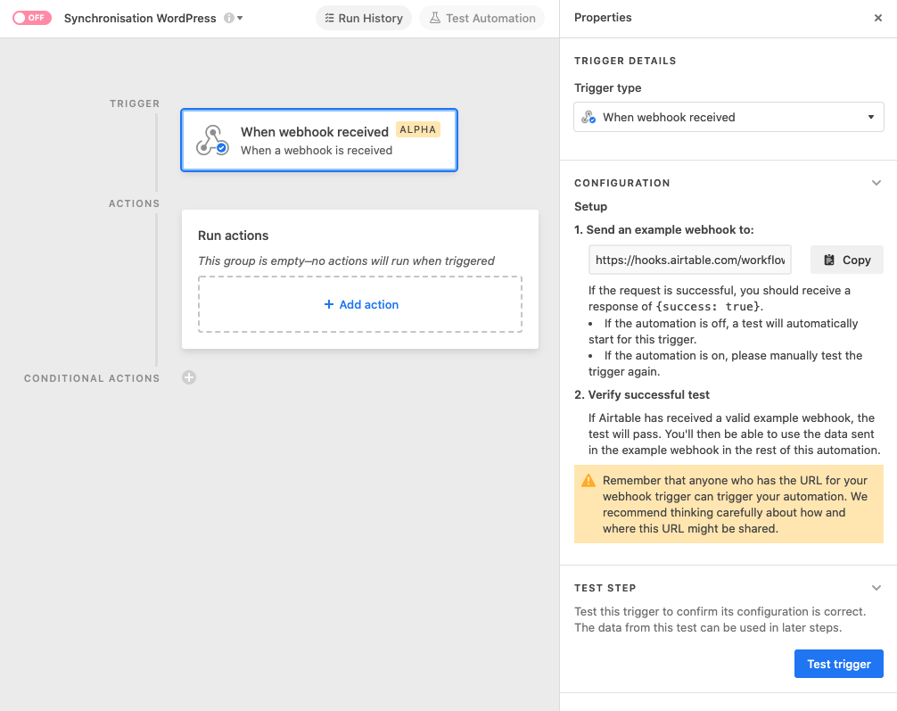
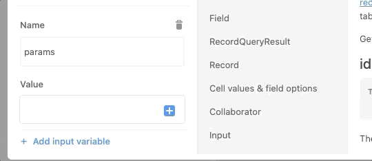

# La passerelle

## À propos

Alors qu’Airtable est de plus en plus utilisé par les organisations culturelles, les besoins d’interaction entre ce système de gestion de bases de données et le CMS WordPress sont grandissants. Qu’il s’agisse de publier un répertoire de membres, d’oeuvres ou de spectacles sur le web, le besoin d’allier la simplicité de gestion des données d’Airtable avec les fonctionnalités de publication de contenu de WordPress sont fréquents.

C’est pour répondre à ce genre de besoins que [RAPAIL](https://rapail.ca/) développe La passerelle: un coffre à outils pour l’intégration de WordPress et Airtable. RAPAIL souhaite évidemment répondre à ses propres besoins. Elle souhaite également faire profiter la communauté culturelle québécoise des travaux qu’elle entreprend.

Le présent dépôt de code contient des extraits de scripts Airtable utilisés par RAPAIL pour synchroniser les données de sa base Airtable avec son site web sous WordPress. Ce code, qui s’appuie sur différentes principes pour répondre à une série de besoins tout en répondant à des contraintes, est complété par une documentation offrant des scénarios d’utilisation en réponse à des besoins types.

## Identification des besoins et des contraintes

À venir.

## Choix d’approche

Au moment de démarrer le projet, la seule option disponible pour intégrer des données depuis Airtable dans WordPress était [l’extension Airpress](https://wordpress.org/plugins/airpress/). Elle a depuis été retirée de l'écosystème WordPress.

Cette extension présentait par ailleurs des limitations fonctionnelles (notamment le fait que les données ne soient pas synchronisées sous la forme de contenus natifs WordPress), en plus de ne pas être supportée par son développeur.

Pour répondre à des objectifs de maintenabilité, notre projet tente de répondre aux différents besoins sans développer d’extension WordPress, ou ajouter dans le projet WordPress des dépendances sur des extensions qui ne sont pas largement utilisée (et donc avec une bonne probabilité d’être maintenue à long terme).

Il s’agit donc essentiellement de développer des scripts dans Airtable qui interragissent avec l’API de WordPress.

## Modèles de données

À venir.

## Principes et conventions

À venir.

## Installation

L'utilisation de La passerelle demande de compléter les étapes suivantes:

1. Préparer l'instance WordPress qui recevra les données.
2. Préparer la base Airtable qui émettra les données.

### 1. Préparer l'instance WordPress

#### 1.1. Extensions pour les modèles de données

Les données provenant d'Airtable porteront probablement sur différents types d'entités (des personnes, des oeuvres, des événements), et elles devront être décrites dans des contenus plus sophistiqués que des articles (des «posts»). Ces données contiendront probablement plusieurs champs, bien au-delà d'un simple titre et d'une description. Votre instance WordPress doit donc disposer d'extensions compatibles avec l'API JSON de WordPress pour gérer ces deux besoins.

Les scripts de La passerelle ont été testés et sont fonctionnels avec les extensions suivantes:

* [Custom Post Type UI (CPT UI)](https://fr.wordpress.org/plugins/custom-post-type-ui/) pour la gestion des types de contenus
* [Advanced Custom Fields (ACF)](https://fr.wordpress.org/plugins/advanced-custom-fields/)

Ces deux extensions doivent être installées et configurées avant d'utiliser le script Airtable de synchronisation de données.

#### 1.2. Nom d'usager et mot de passe

Par ailleurs, afin de permettre un accès sécuritaire aux données, il est nécessaire de prévoir un mécanisme d'authentification. La solution _Application Passwords_ est intégrée à WordPress pour les versions 5.6 et plus récentes. Si vous ne disposez pas de cette extension, il faut l'installer:

* [Application Passwords](https://fr.wordpress.org/plugins/application-passwords/)

Enfin, il faut créer un usager et son mot de passe pour le script Airtable. Les étapes à suivre sont décrites à la section «Getting Credentials / Generating Manually» du [guide d'intégration de Application Passwords](https://make.wordpress.org/core/2020/11/05/application-passwords-integration-guide/). À la fin du processus, notez dans un endroit sécurisé le nom d'usager associé au compte, et le mot de passe d'application (il est important de le noter dès qu'il vous est affiché, car il ne sera pas possible de le récupérer par la suite).

### 2. Préparer la base Airtable

Pour réaliser les synchronisations, il est nécessaire d'installer le script de synchronisation principal dans la base Airtable qui contient les données maîtres.

> **Note:** Il est possible de configurer et d'utiliser le script de synchronisation de plusieurs façons dans Airtable. Nous présentons ici l'approche que nous préconisons, et qui consiste à copier le code principal _une seule fois_ dans Airtable, puis de l'appeler depuis des extensions et des automatisations. Si vous comprenez bien le fonctionnement du code, les enjeux de sécurité, et les outils disponibles dans Airtable, vous pouvez faire des choix différents.

#### 2.1. Créer une automatisation déclenchée par un lien HTTP («webhook»)

Dans «Automations», choisissez «Create automation», et nommez l'automatisation (par exemple, «Script WordPress»). Cliquez sur «Add trigger», puis sélectionnez le déclencheur «When webhook received». L'automatisation devrait ressembler à ceci:

Copiez le lien disponible sous «Send an example webhook to» et conservez le dans un endroit sécurisé.

#### 2.2. Installer le script de synchronisation

Dans l'automatisation, sous «Run actions», cliquez sur «+ Add action», puis sélectionnez l'option «Run script».

La fenêtre d'édition de script vous sera présentée. Supprimez le contenu de la section «Code» et copiez y le contenu du [script principal](scripts/main.js).

#### 2.3. Configurer les accès à WordPress et les variables de paramétrage du script

Dans la section de gauche de la fenêtre d'édition du script, vous devrez créer quatre variables de configuration. Pour chaque variable, cliquez sur "+ Add input variable", puis entrez les valeurs suivantes dans les champs «Name» et «Value».

|Name|Value|
|----|-----|
|wordpressInstanceUrl|L'URL de votre site WordPress, sous la forme «https://nomdedomaine.com/» (en incluant le symbole `/` final)|
|wordpressUserName|Le nom de l'usager WordPress associé au mot de passe d'application crée à l'étape 1.2|
|applicationPassword|Le mot de passe d'application créé à l'étape 1.2|
|params|Vide pour l'instant.|

#### 2.4. Générer des données de tests pour l'automatisation

Pour compléter la configuration de la quatrième variable, des données de test sont nécessaires. Pour les obtenir, il faut réaliser un premier appel de test au script.

Nous suggérons de créer une extension dédiée à ce test. Pour ce faire:

* retournez à l'interface principale de votre baes en cliquant sur «Data» dans la barre d'outil du haut de l'écran
* cliquez sur «Extensions»
* cliquez sur «+ Add an extension», choisissez l'extension «Scripting», puis cliquez sur «Add extension»
* la fenêtre d'édition de script apparaîtra. Au besoin, fermez la fenêtre de présentation en cliquant sur «Get Started», puis «Start from scratch»
* supprimez le contenu de la fenêtre d'édition du script
* copiez-y le contenu du [script de test](scripts/test.js), et remplacez `{{URL}}` par le lien que vous avez noté à l'étape 2.1

Ensuite, il suffit d'exécuter le script de test en cliquant sur le bouton «Run» de la partie droite de l'écran. Si toutes les étapes ont bien été complétées, vous devriez obtenir un résultat similaire à celui-ci:

> **Note:** Vous pouvez supprimer l'extension utilisée pour le test, elle ne sera plus utile.

#### 2.5. Compléter les configurations des variables de paramétrage du script

Retournez dans la section «Automations» et sélectionnez l'automatisation créée à l'étape 2.1.

Cliquez sur la déclencheur «When webhook received», puis sur le bouton «Test trigger» dans la section de droite de l'écran. Le message «Step successful» devrait apparaître

Cliquez sur la tâche «Run a script», puis ouvrez la fenêtre d'édition du code avec le bouton «Edit script».

Dans la fenêtre d'édition du code, repérez la variable d'entrée `params` créée à l'étape 2.3. Dans le champs «Value», insérez le contenu de `params` de la façon suivante:

Fermez la fenêtre d'édition du script en cliquant sur «Finish editing».

#### 2.6. Activer l'automatisation

Pour activer l'automatisation, il suffit de cliquer sur le bouton rouge indiquant «Off» pour qu'il devienne vert et indique «On».

## Utilisation

Les outils de synchronisation devra être personnalisée selon vos besoins.

Il s'agit essentiellement de créer des extensions (pour les synchronisation déclenchées manuellement) ou des automatisations (pour les synchronisations déclenchées de façon périodique, ou en réaction à un déclencheur externe à la base de données) qui utiliseront le script principal, en lui envoyant des paramètres qui permettront de faire des choix sur les données à synchroniser (la table, les champs et les enregistrements ciblés, et les correspondances avec les éléments équivalents dans WordPress).

Dans tous les cas, il s'agit de faire un appel au lien HTTP («webhook»), comme à l'étape 2.4, en utilisant des valeurs adaptées dans la variable `params`. Les options de la variable `params` sont documentées dans la section [API](api.md). Le lien HTTP peut être appelé depuis une extension, une automatisation, ou même une application externe.

Des exemples pour des cas d'utilisation communs suivent. Dans tous les cas, les scripts contiennent des références à des tables et des champs fictifs: vous devez les modifier pour tenir compte de votre base de données.

#### 3.1. Synchroniser manuellement un enregistrement

Pour ce cas de figure, l'approche suggérée est de créer une extension qui permet de sélectionner un enregistrement (avec `input.recordAsync`). L'extension peut être déclenchée par un champ de type «Button» au besoin. L'extension doit contenir un script inspiré de l'exemple [recordSync.js](scripts/recordSync.js).

#### 3.2. Synchroniser manuellement un table en entier

L'approche est similaire à l'exemple 3.1, sauf pour le champ `Button`, non pertinent dans ce cas-ci. Le script à utiliser est  [tableSync.js](scripts/tableSync.js).

#### 3.3. Synchroniser le contenu d'une vue de façon récurrente à tous les jours, à la même heure.

Dans ce cas, il est suggéré de créer une automatisation avec un déclencheur périodique. L'action de l'automatisation sera l'exécution d'un script, dont le contenu sera inspiré de  [viewSync.js](scripts/viewSync.js).

## Références

La page dédiée à l'[API](api.md) contient les références détaillées sur les options du script, le types de champs, etc.
