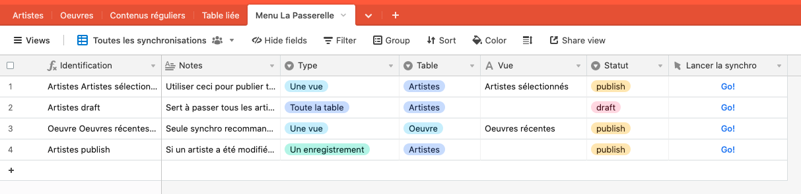

# Exemples de scripts

Des exemples pour des cas d'utilisation communs suivent. Dans tous les cas, les scripts contiennent des références à des tables et des champs fictifs: vous devez les modifier pour tenir compte de votre base de données.

## Synchroniser manuellement un enregistrement

Pour ce cas de figure, l'approche suggérée est de créer une extension qui permet de sélectionner un enregistrement (avec `input.recordAsync`). L'extension peut être déclenchée par un champ de type «Button» au besoin. L'extension doit contenir un script inspiré de l'exemple [recordSync.js](../scripts/recordSync.js).

## Synchroniser manuellement une table en entier

L'approche est similaire à l'exemple 3.1, sauf pour le champ `Button`, non pertinent dans ce cas-ci. Le script à utiliser est  [tableSync.js](../scripts/tableSync.js).

## Synchroniser le contenu d'une vue de façon récurrente à tous les jours, à la même heure.

Dans ce cas, il est suggéré de créer une automatisation avec un déclencheur périodique. L'action de l'automatisation sera l'exécution d'un script, dont le contenu sera inspiré de [viewSync.js](../scripts/viewSync.js).

## Synchroniser une vue en entier, mais enregistrement par enregistrement.

Il peut arriver que la synchronisation d'une vue (ou d'une table) en entier ne fonctionne pas, parce que la taille des données fait en sorte que le script principal aurait besoin de plus de 30 secondes d'exécution, la limite imposée par Airtable.

Dans ce cas, il est recommandé d'appeler le script principal pour chaque enregistrement, comme illustré dans [loopOverRecordsSync.js](../scripts/loopOverRecordsSync.js)

## Synchroniser des données depuis une automatisation Airtable

L'environnement d'exécution des automatisations dans Airtable est légèrement différent de celui des extensions. Notamment:

* les API `input` et `output` ne sont pas disponibles;
* l'appel au webhook du script principal doit être réalisé avec `fetch` plutôt que `remoteFetchAsync`.

L'exemple précédent de synchronisation d'un seul enregistrement est repris pour une automatisation dans [automationRecordSync.js](../scripts/automationRecordSync.js). Dans cet exemple, la valeur `{{recordId}}` doit correspondre à un identificant d'enregistrement dans la table concernée, qui peut être obtenu de différentes façons, par exemple par une variable d'entrée.

## [Avancé] Un seul script pour plusieurs types d'opérations, et pour maintenir une seule table de correspondances

Dans le cas où plusieurs tables doivent être synchronisées, avec des variantes pour un seul enregistrement à la fois, ou une vue entière, ou la table entière, il peut devenir compliqué de gérer les nombreuses extensions. Cette complexité affecte à la fois les développeurs qui configurent les extensions, que les utilisateurs qui doivent naviguer à travers les tables et les extensions.

Une approche pour résoudre ce problème consiste à utiliser un seul script contenant la table de correspondance des champs de toutes les tables, qui sait réaliser tous les types de synchronisations, et qui peut détecter le type de synchronisation en fonction du contexte de l'utilisateur.

Le script [le_menu.js](../scripts/le_menu.js), combiné à une table Airtable permettant de stocker des configurations, implante cette approche. Installez le dans une extension de type script, comme pour les autres scripts. Ensuite, indiquez l'URL du webhook déclencheur du script principal dans le champ de configuration prévu à cette fin.

Pour fonctionner, le script s'appuie sur des configurations qui doivent être stockées dans une table dédiée à cette fin. La table, nommée «Menu La Passerelle», contient des enregistrements qui correspondent à des types de synchronisation (telle vue de telle table; ou telle table en entier; ou un seul enregistrement pour une table donnée; etc.). Elle doit contenir les champs suivants:

|Champ|Priorité|Type et contenu|Utilité|
|---|---|---|---|
|Identificateur|Obligatoire|Au choix|Sera affichée à l'usager pour sélectionner l'opération qu'il souhaite réaliser|
|Notes|Optionnel|Texte long|Pour documenter l'utilisation de ce type de synchronisation|
|Type|Obligatoire|Texte ou selection simple|Indique le type de synchronisation. Les options possible sont «Toute la table», «Une vue» et «Un enregistrement» (l'orthographe doit être respecté strictement)|
|Table|Obligatoire|Texte ou selection simple|Indique la table visée par la synchronisation. L'orthographe doit strictement être identique au nom de la table.|
|Vue|Obligatoire|Texte ou selection simple|Indique la vue visée par la synchronisation, si le type concerne une vue|
|Statut|Optionnel|Texte ou selection simple|Doit contenir le statut WordPress qui sera appliqué, par exemple `publish` ou `draft`|
|Lancer la synchronisation (nom libre)|Bouton|Obligatoire|Bouton qui déclenche l'exécution du script du menu|

Voici un exemple d'une telle table:



Il est également possible d'ajouter des champ de type bouton, qui déclenche le script à partir d'autres tables. Leur utilisation permet d'avoir des boutons de synchronisation individuelle d'un seul champ pour n'importe quelle table, tout en bénéficiant de la configuration unique des tables de correspondance dans le script Le Menu. À noter que dans cette configuration, le statut sera toujours `publish`, sauf si le nom de la vue d'où le script est appelé contient le mot «brouillon».

Pour éviter la confusion :

* un clic sur le bouton dans la table du Menu exécute l'opération configurée dans l'enregistrement concerné du menu ;
* un clic sur le bouton dans une autre table synchronise un seul champ.

## [Avancé] Paramètres par défaut pour le script principal

Une autre approche pour répondre au besoin décrit à l'exemple précédent est de définir des paramètres par défaut qui s'appliqueront à tous les appels au script principal. Les paramètres passés lors de l'appel au script auront priorité sur les paramètres par défaut.

Les paramètres par défaut doivent être passés par la variable d'entrée `defaultParams` sous la forme d'une version «stringifiée» d'un objet de configuration.

Cette chaîne de caractères peut être préparée par un bloc de script distinct du script principal. Ainsi, l'automatisation contenant le script principal peut prendre la forme suivante:


Dans cette automatisation, le second script correspond simplement au script principal. Le premier script contient simplement un objet dont les clés correspondent aux noms des tables, et les valeurs contiennent un objet de configuration. Par exemple:

```
let defaultParams = {
    'Artistes': {
        airtable: {
            table: 'Artistes',
            wpIdField: 'Identifiant WordPress',
            ...
        },
        wordpress: {
            postType: 'artiste',
            acf: {
                    'nom': 'Nom',
                    'prenom': 'Prénom',
                    'courriel': 'Courriel',
                    ...
            },
            'content': 'Contenu',
            'featured_media': 'Photo'
        }
    },
    'Oeuvres': {
        airtable: {
            table: 'Oeuvres',
            ...
        },
        wordpress: {
          ...
        }
    }
}

output.set('defaultParams', JSON.stringify(defaultParams));
```

La valeur de sortie du premier bloc de script doit être configuré comme variable d'entrée du deuxième bloc de script.
