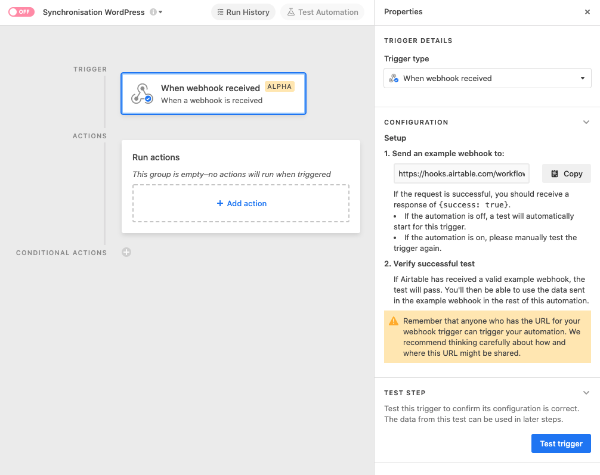
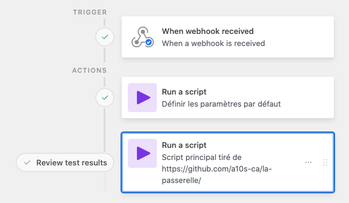
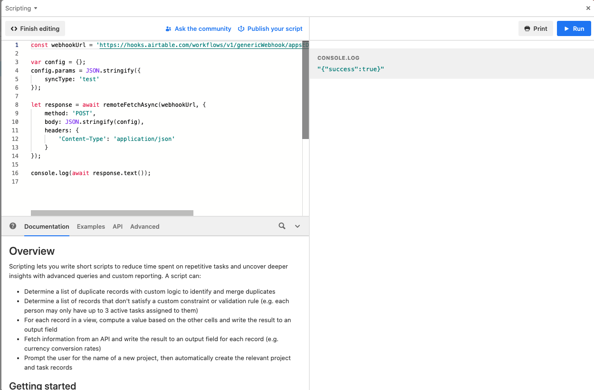

# Installation de La Passerelle

L'utilisation de La Passerelle demande de compléter les étapes suivantes:

1. Préparer l'instance WordPress qui recevra les données.
2. Préparer la base Airtable qui émettra les données.


### 1. Préparer l'instance WordPress


#### 1.1. Extensions pour les modèles de données

Les données provenant d'Airtable porteront probablement sur différents types d'entités (des personnes, des oeuvres, des événements), et elles devront être décrites dans des contenus plus sophistiqués que des articles (des «posts»). Ces données contiendront probablement plusieurs champs, bien au-delà d'un simple titre et d'une description. Votre instance WordPress doit donc disposer d'extensions compatibles avec l'API JSON de WordPress pour gérer ces deux besoins.

Les scripts de La passerelle ont été testés et sont fonctionnels avec les extensions suivantes:

* [Custom Post Type UI (CPT UI)](https://fr.wordpress.org/plugins/custom-post-type-ui/) pour la gestion des types de contenus
* [Advanced Custom Fields (ACF)](https://fr.wordpress.org/plugins/advanced-custom-fields/)

Ces deux extensions doivent être installées et configurées avant d'utiliser le script Airtable de synchronisation de données.


#### 1.2. Nom d'usager et mot de passe

Par ailleurs, afin de permettre un accès sécuritaire aux données, il est nécessaire de prévoir un mécanisme d'authentification. La solution _Application Passwords_ est intégrée à WordPress pour les versions 5.6 et plus récentes. Si vous ne disposez pas de cette extension, il faut l'installer:

* [Application Passwords](https://fr.wordpress.org/plugins/application-passwords/)

Enfin, il faut créer un usager et son mot de passe pour le script Airtable. Les étapes à suivre sont décrites à la section «Getting Credentials / Generating Manually» du [guide d'intégration de Application Passwords](https://make.wordpress.org/core/2020/11/05/application-passwords-integration-guide/). À la fin du processus, notez dans un endroit sécurisé le nom d'usager associé au compte, et le mot de passe d'application (il est important de le noter dès qu'il vous est affiché, car il ne sera pas possible de le récupérer par la suite).


### 2. Préparer la base Airtable

Pour réaliser les synchronisations, il est nécessaire d'installer le script de synchronisation principal dans la base Airtable qui contient les données maîtres.

> **Note:** Il est possible de configurer et d'utiliser le script de synchronisation de plusieurs façons dans Airtable. Nous présentons ici l'approche que nous préconisons, et qui consiste à copier le code principal _une seule fois_ dans Airtable, puis de l'appeler depuis des automatisations. Si vous comprenez bien le fonctionnement du code, les enjeux de sécurité, et les outils disponibles dans Airtable, vous pouvez faire des choix différents.

#### 2.0. Créer les champs nécessaires dans la base de données

Dans chaque table que vous souhaitez synchroniser via La Passerelle, créez les champs suivant :

- Afficher sur le site web (type : Case à cocher)
- Date de synchronisation (type : Date, format : ISO, inclure l'heure)
- Date de modification (type : Date/heure de dernière modification, Champs : Champs spécifiques, cocher tous les champs qui doivent déclencher une mise à jour sur le site web, format : ISO, inclure l'heure, )
- Meta (type : Texte long)
- ID Wordpress (type : Texte sur une seule ligne)
- Statut de synchronisation (type : Formule)

Voici la formule à copier dans le champ Statut de synchronisation :

````
IF({Afficher sur le site web},

  IF(NOT({Meta}), "à synchroniser",

  IF(SEARCH('"status":"draft"', {Meta}),"à synchroniser",

    IF(SEARCH('"status":"publish"', {Meta}), 

      IF(IS_AFTER({Date de synchronisation}, {Date de modification}),
          "à jour (publié)", "à synchroniser")))),

  IF(SEARCH('"status":"publish"', {Meta}), "à passer en brouillon",
  IF(SEARCH('"status":"draft"', {Meta}), "brouillon")))
````


#### 2.1. Créer une automatisation déclenchée par un lien HTTP («webhook»)

Dans «Automatisations», choisissez «Céer une automatisation», et nommez l'automatisation (par exemple, «La Passerelle - Script principal»). Cliquez sur «Ajouter un déclencheur», puis sélectionnez le déclencheur «Lorsqu'un point d'ancrage wev est reçu». L'automatisation devrait ressembler à ceci:



Copiez le lien disponible sous «Envoyez un exemple de point d'ancrage web vers» et conservez le dans un endroit sécurisé.


#### 2.2. Installer le script de paramétrage

Ce script contient simplement un objet dont les clés correspondent aux noms des tables, et les valeurs contiennent un objet de configuration. 

Dans l'automatisation, sous «Run actions», cliquez sur «+ Add action», puis sélectionnez l'option «Run script».

La fenêtre d'édition de script vous sera présentée. Supprimez le contenu de la section «Code» et copiez-y le code suivant :

````
let defaultParams = {
    '{{ID de la table}}': { // {{Nom de la table}}
        airtable: {
            table: 'ID de la table', // {{Nom de la table}}
            wpIdField: '{{ID du champ contenant l'identifiant wordpress}}', // {{Nom du champ contenant l'identifiant wordpress}}
            ...
        },
        wordpress: {
            postType: '{{Nom du post type appropié pour cette table dans Wordpress}}',
            acf: {
                    '{{Nom du champ dans Wordpress}}': '{{ID du champ dans Airtable}}', // {{Nom du champ dans Airtable}}
                    '{{Nom du champ dans Wordpress}}': '{{ID du champ dans Airtable}}', // {{Nom du champ dans Airtable}}
                    ...
            },
            'content': 'Contenu',
            'featured_media': 'Photo'
        }
    },
    {{Idem pour les autres tables...}}
}

output.set('defaultParams', JSON.stringify(defaultParams));

````

Remplacez tous les {{placeholders}} par les informations provenant de votre base de données.

> **Note:** Nous utilisons les IDs des tables Airtable et les ID des champs Airtable au lieu de leur nom afin de rendre le script résilient au renommage des champs et des tables. Cela rend par contre le script plus difficile à lire, c'est pourquoi nous ajoutons les noms des tables et des champs en commentaire sur chaque ligne où ils sont référencés. Vous pouvez choisir d'utiliser les noms des tables et les noms des champs au lieu des IDs. 

Pour obtenir l'ID d'un champ, vous pouvez utiliser le Field Manager (voir l'article [Finding Airtable IDs](https://support.airtable.com/docs/finding-airtable-ids) dans la documentation officielle Airtable).

Pour obtenir l'ID d'une table, vous pouvez utiliser le script suivant, dans une extension :

````
for (const table of base.tables) {
    output.markdown(`**${table.name}** : ${table.id}`);
}

````

Voici un exemple de ce à quoi pourrait ressembler votre code, une fois les {{placeholders}} remplacés :

```
let defaultParams = {
    'tblb00KvosFf8HmdE': { // Dossiers
        airtable: {
            table: 'tblb00KvosFf8HmdE', // Dossiers
            wpIdField: 'fldgxpzXiXxJGPxMz', // ID Wordpress
            titleField: "fldFJ5wSQC59MSJnO", // Nom du dossier
            metaFieldName: 'fldGmie09tmm6HTeV', // Meta
            lastSyncFieldName: 'fldG0r0AY1bZ4PdOe', // Date de synchronisation
        },
        wordpress: {
            postType: 'membre',
            featured_media: 'fldjxnQtsSB4ZvHH3', // Image répertoire
            content: 'fldPIMUrW1c4JmDqV', // Description répertoire
            status: 'publish',
            acf: {
                    'styles': 'fldBRkOYenTJaaqoG', // Styles musicaux CQM
            },
        }
    },
}

output.set('defaultParams', JSON.stringify(defaultParams));
```

La valeur de sortie de ce premier bloc de script sera configurée dans une étape suivante comme variable d'entrée du deuxième bloc de script (_defaultParams_).


#### 2.3. Installer le script de synchronisation

Dans l'automatisation, cliquez sur «Ajouter une action ou une logique avancée», puis sélectionnez l'option «Exécuter le script».

La fenêtre d'édition de script vous sera présentée. Supprimez le contenu de la section «Code» et copiez y le contenu du [script principal](../scripts/main.js).


#### 2.4. Configurer les accès à WordPress et les variables de paramétrage du script

Dans la section de gauche de la fenêtre d'édition du script, vous devrez créer quatre variables de configuration. Pour chaque variable, cliquez sur "+ Add input variable", puis entrez les valeurs suivantes dans les champs «Name» et «Value».

|Nom|Valeur|
|----|-----|
|wordpressInstanceUrl|L'URL de votre site WordPress, sous la forme «https://nomdedomaine.com/» (en incluant le symbole `/` final)|
|wordpressUserName|Le nom de l'usager WordPress associé au mot de passe d'application crée à l'étape 1.2|
|applicationPassword|Le mot de passe d'application créé à l'étape 1.2|
|params|Vide pour l'instant.|
|defaultParams|Sélectionner la valeur de sortie du script précédent|

Votre automatisation devrait ressembler à ceci : *!!!*




#### 2.5. Générer des données de tests pour l'automatisation

Pour compléter la configuration de la quatrième variable (params), des données de test sont nécessaires. Pour les obtenir, il faut réaliser un premier appel de test au script.

Nous suggérons de créer une extension dédiée à ce test. Pour ce faire:

* retournez à la section "données" votre base en cliquant sur «Data» dans la barre d'outil du haut de l'écran
* cliquez sur «Extensions»
* cliquez sur «+ Add an extension», choisissez l'extension «Scripting», puis cliquez sur «Add extension»
* la fenêtre d'édition de script apparaîtra. Au besoin, fermez la fenêtre de présentation en cliquant sur «Get Started», puis «Start from scratch»
* supprimez le contenu de la fenêtre d'édition du script
* copiez-y le contenu du [script de test](../scripts/test.js), et remplacez `{{URL}}` par le lien que vous avez noté à l'étape 2.1

Ensuite, il suffit d'exécuter le script de test en cliquant sur le bouton «Run» de la partie droite de l'écran. Si toutes les étapes ont bien été complétées, vous devriez obtenir un résultat similaire à celui-ci:




> **Note:** Vous pouvez supprimer l'extension utilisée pour le test, elle ne sera plus utile.


#### 2.6. Compléter les configurations des variables de paramétrage du script

Retournez dans la section «Automatisations» et sélectionnez l'automatisation créée à l'étape 2.1.

Cliquez sur la déclencheur «Lorsqu'un point d'ancrage est reçu», puis sur le bouton «Tester le déclencheur» dans la section de droite de l'écran. Le message «Étape terminée» devrait apparaître en vert.

Cliquez sur l'Action «Exécuter un script», puis ouvrez la fenêtre d'édition du code avec le bouton «Modifier le code».

Dans la fenêtre d'édition du code, repérez la variable d'entrée `params` créée à l'étape 2.3. Dans le champs «Valeur», insérez le contenu de `params` de la façon suivante:


Fermez la fenêtre d'édition du script en cliquant sur «Terminer la modification».

Activez l'automatisation.

#### 2.7 Créer une automatisation d'appel pour la publication et la mise à jour

Créer une automatisation

Nommez votre automatisation "{{Nom de la table}} - publier et/ou mettre à jour".

Ajouter un déclencheur / Lorsqu'une entrée correspond aux condition

Tableau : Sélectionner le tableau qui contient vos données à envoyer sur Wordpress

Conditions : Quand "Statut de synchronisation" contient "à synchroniser"

"Ajouter une action ou une logique avancée" / Choisir "Excécuter le script"

Add input variable

|Nom|Valeur|
|----|-----|
|table_idl'id Airtable de la table contenant les données (commence par tbl)||
|record_id|+ / Insert value from field / ID de l'entrée Airtable|
|status|publish|
|custom_post_type_name|le nom de votre custoom post type dans Wordpress|
|webhook_url|coller le lien de l'étape 2.1|

Dans l'encadré "Code", supprimer le contenu par défaut et copier le code suivant :

````
const inputConfig = input.config();

var config = {};

// we stringify the params key, which will be double-stringified in the request body, so that we can
// pass it serialized to the automation script, which will deserialize it. This is because Airtable will not
// allow us to use specific keys in automation script config.
config.params = JSON.stringify({
    syncType: 'record',
    airtable: {
        table: inputConfig.table_id,
        recordId: inputConfig.record_id
    },
    wordpress: {
        status: inputConfig.status,
        postType: inputConfig.custom_post_type_name
    }
});

let response = await fetch(inputConfig.webhook_url, {
    method: 'POST',
    body: JSON.stringify(config),
    headers: {
        'Content-Type': 'application/json'
    }
});
console.log(await response.text());
````

Cliquer sur "Terminer la modification".

Activer l'automatisation.

#### 2.8 Créer une automatisation d'appel pour passer en brouillon ("dépublier")

Répétez l'étape précédente, avec les trois variations suivantes :

- Nommez votre automatisation "{{Nom de la table}} - passer en brouillon (dépublier)".
- Dans le déclencheur, utilisez la condition suivante : Quand "Statut de synchonisation" contient " à passer en brouillon"
- Dans le script, la valeur l'input variable "status" sera "draft" au lieu de "publish".

#### 2.9 Rangement

Dans le menu de création d'automatisation, créez une section.

Nommez votre section "La Passerelle".

Rangez vos trois automatisations dans cette section.
